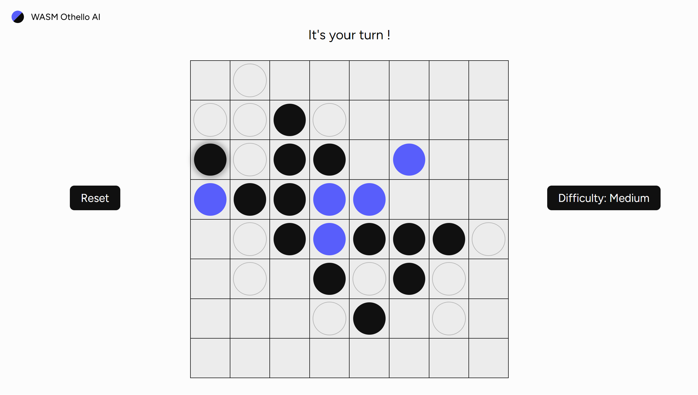

# Othello AI WASM & Solid.js

This project is an AI Othello game using TypeScript, solid.js and WebAssembly(WASM) (compiled from C).  
**You can test it here: [othello AI](https://elib27.github.io/Othello-AI-wasm/)**

## The AI algorithm
The AI employs the minimax (negamax) algorithm, delving into potential future moves and determining the optimal choice through a heuristic function. This function alternates between maximizing the AI's advantage and minimizing the opponent's moves.

The heuristic function encompasses the following parameters:

- **Stability:** The count of discs that cannot be reversed.
- **Parity:** The difference between the number of discs owned by the AI and the opponent.
- **Position:** The value assigned to the position of the discs on the board.

## The project

For the UI, I have utilized [Solid.js](https://www.solidjs.com/), a reactive JavaScript framework. The game logic is implemented in TypeScript. The AI algorithm is crafted in C and compiled to WASM for enhanced performance. The AI in [WASM](https://webassembly.org/) is loaded, compiled, and executed asynchronously within a Web Worker, ensuring a seamless gaming experience.
