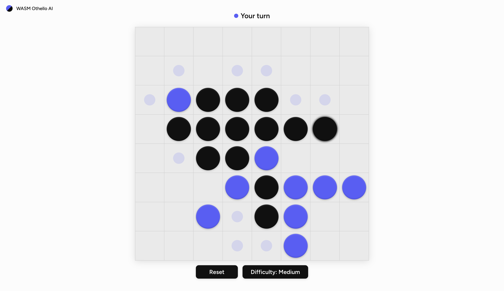

# Othello AI — WebAssembly & Solid.js

An Othello (Reversi) game where you play against an AI opponent. The game UI is built with [Solid.js](https://www.solidjs.com/) and the game logic in TypeScript, while the AI engine is written in C, compiled to [WebAssembly](https://webassembly.org/), and run off the main thread in a Web Worker for a smooth, responsive experience.

**▶️ Play it here: [Othello AI](https://elib27.github.io/Othello-AI-wasm/)**



## Features

- 🧠 Native-speed AI powered by a negamax algorithm compiled to WebAssembly
- ⚙️ Three difficulty levels (Easy, Medium, Hard) that adjust search depth
- 🧵 AI runs in a Web Worker, so the UI never freezes while it thinks
- ✨ Animated discs — placement and flip animations, last-AI-move highlight, and legal-move hints
- 📱 Responsive board that scales from mobile to desktop

## How it works

```
┌─────────────┐   move    ┌──────────────┐  board+player  ┌──────────────────┐
│  Solid.js   │ ────────► │  Web Worker  │ ─────────────► │  WASM AI engine  │
│  UI + state │           │ (AIworker.ts)│                │  (othelloAI.c)   │
│ (othello.ts)│ ◄──────── │              │ ◄───────────── │                  │
└─────────────┘  AI move  └──────────────┘   best move    └──────────────────┘
```

- **`src/othello.ts`** — game rules and state (legal moves, flipping, scoring, win detection).
- **`src/components/`** — Solid.js components for the board, game status, and result screen.
- **`src/AIworker.ts`** — Web Worker that loads the WASM module, marshals the board into shared memory, and calls into the engine.
- **`othelloAI.c`** — the AI engine, compiled to `src/othelloAI.wasm`.

When it's the AI's turn, the board is serialized into the WASM module's linear memory and `getAImove` is invoked. The computed move is posted back to the UI thread, with a minimum "thinking" delay so the AI's turn feels natural.

## The AI algorithm

The AI uses the **negamax** variant of minimax with **alpha–beta pruning** to search the game tree and pick the move that maximizes its advantage while minimizing the opponent's options.

Positions are scored with a heuristic combining:

- **Stability** — discs that can no longer be flipped (e.g. along secured edges).
- **Parity** — the disc-count difference between the AI and the opponent.
- **Position** — a weighting of each square, favoring strong squares like corners and penalizing risky ones.

Search depth adapts to both the **difficulty level** and the **game phase** (opening, midgame, endgame).

## Getting started

Requires [Node.js](https://nodejs.org/) and a package manager (npm shown below).

```bash
# install dependencies
npm install

# start the dev server
npm run dev

# build for production
npm run build

# preview the production build
npm run serve
```

### Rebuilding the WASM engine (optional)

The compiled `src/othelloAI.wasm` is committed, so you only need this if you change `othelloAI.c`. It requires the [Emscripten SDK](https://emscripten.org/):

```bash
emcc othelloAI.c -O3 --no-entry -s STANDALONE_WASM \
  -s EXPORTED_FUNCTIONS=_getAImove \
  -o src/othelloAI.wasm
```

## Tech stack

| Layer       | Technology                   |
| ----------- | ---------------------------- |
| UI          | Solid.js, CSS Modules        |
| Game logic  | TypeScript                   |
| AI engine   | C → WebAssembly (Emscripten) |
| Concurrency | Web Worker                   |
| Tooling     | Vite, TypeScript             |
